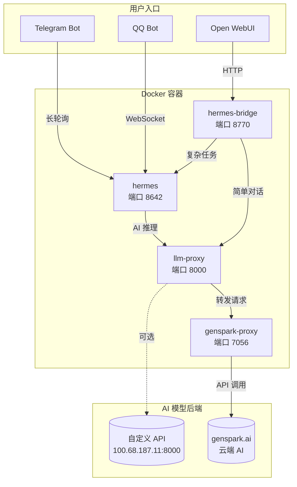

# OpenDeepSeek 架构总览

## 系统架构图



## 模型汇总表

| 模型名称 | 提供商 | 默认使用 |
|---------|--------|---------|
| **GPT-5.5-Pro** | GenSpark | ⭐ 默认 |
| GPT-5.5 | GenSpark | |
| GPT-5.4 | GenSpark | |
| GPT-5.4-Pro | GenSpark | |
| GPT-5.4-Mini | GenSpark | |
| GPT-5.4-Nano | GenSpark | |
| GPT-5.2-Pro | GenSpark | |
| O3-pro | OpenAI | |
| ClaudeSonnet-4.6 | Anthropic | |
| Claude-Opus-4.8 | Anthropic | |
| Claude-Opus-4.7 | Anthropic | |
| Claude-Opus-4.6 | Anthropic | |
| Claude-Haiku-4.5 | Anthropic | |
| Gemini-3-Flash-Preview | Google | |
| Gemini-3.1-Pro-Preview | Google | |
| Gemini-3.1-Flash-Lite | Google | |
| Gemini-3.5-Flash | Google | |
| DeepSeek-V4-Pro | DeepSeek | |
| DeepSeek-V4-Flash | DeepSeek | |
| Trinity-Large-Thinking | Nous Research | |
| Minimax-M2.7 | MiniMax | |
| Kimi-K2.6 | Moonshot | |
| Grok-4.20-Reasoning | xAI | |
| Grok-4.20 | xAI | |

## 配置文件路径

| 文件 | 用途 |
|------|------|
| `/root/opendeepseek/.env` | 主环境配置 |
| `/root/opendeepseek/docker-compose.yml` | 容器编排 |
| `/root/opendeepseek/bridge/llm_proxy.py` | LLM 代理配置 |
| 容器内: `/opt/data/config.yaml` | Hermes 模型配置 |

## 常用命令

```bash
# 查看所有容器状态
docker ps

# 查看日志
docker logs opendeepseek-hermes -f
docker logs opendeepseek-hermes-bridge -f
docker logs opendeepseek-llm-proxy -f

# 重启服务
docker compose restart

# 停止服务
docker compose down

# 更新代码并重启
git pull && docker compose build hermes-bridge && docker compose up -d
```
