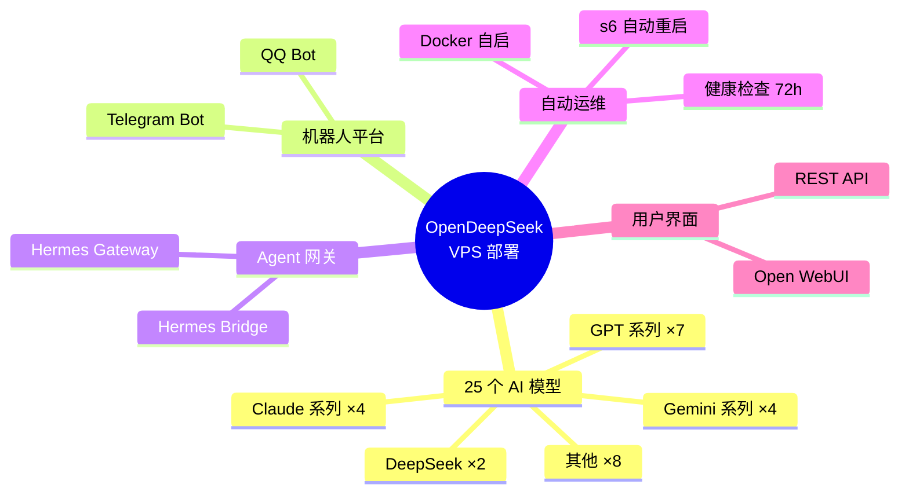
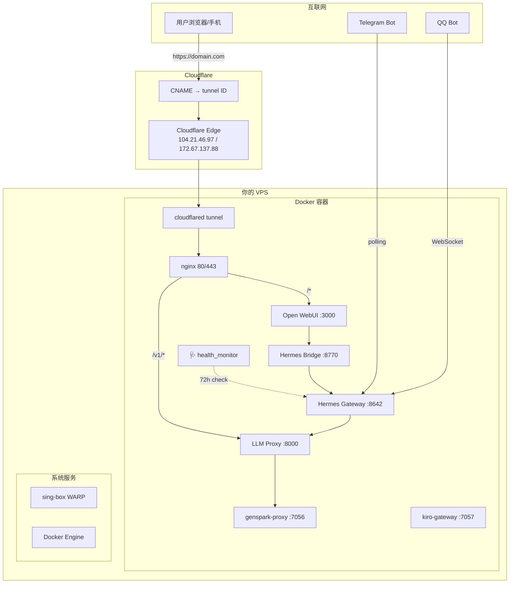
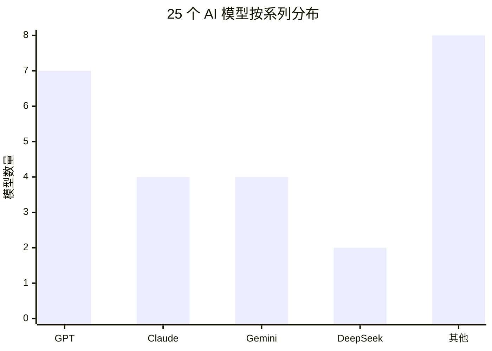
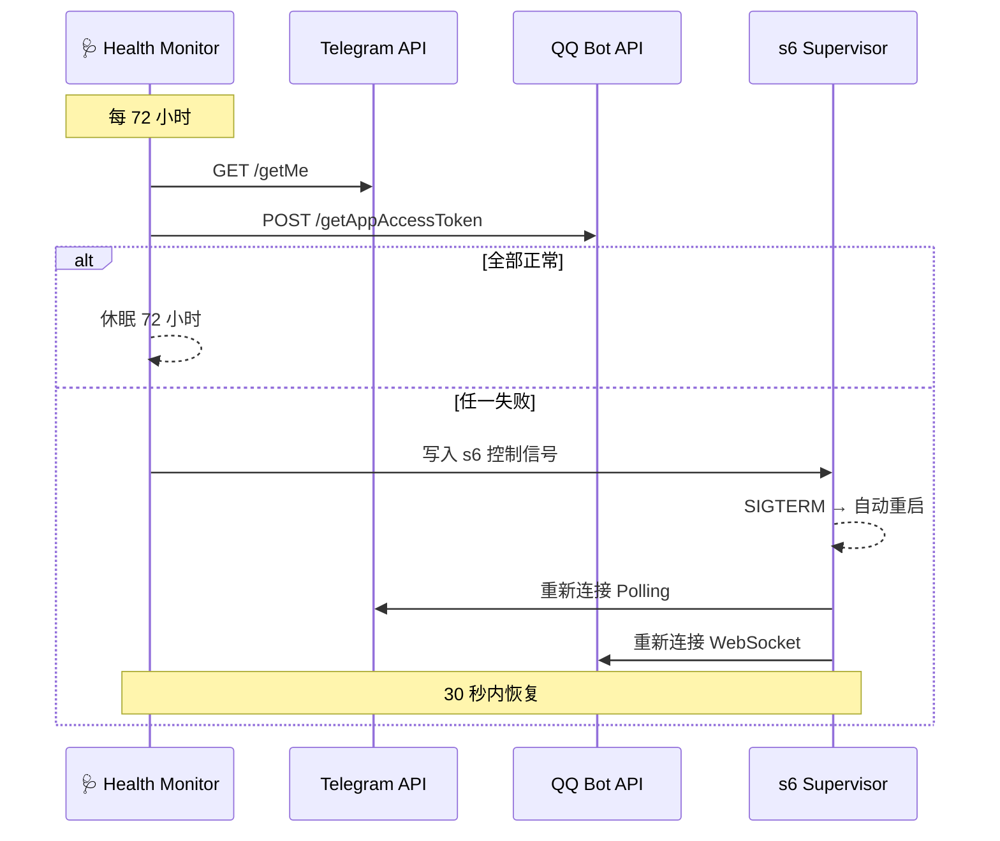
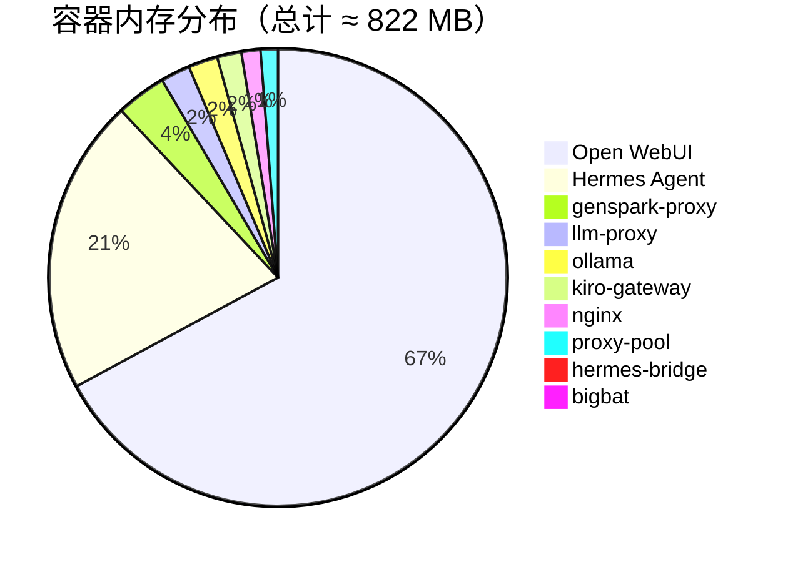

# 🚀 OpenDeepSeek VPS 一键部署

> 在新 VPS 上 **一条命令** 部署完整 AI 平台：25 个大模型 + Telegram/QQ 机器人 + Agent 网关 + 健康自愈

```bash
bash <(curl -fsSL https://raw.githubusercontent.com/520mmxx/vpsme/main/install.sh) --domain YOUR_DOMAIN
```

---

## 📊 项目总览



---

## 🏗️ 系统架构



---

## 🤖 全部 25 个 AI 模型

| 系列 | 模型名称 | 上游提供商 |
|------|----------|-----------|
| **GPT** | GPT-5.4, GPT-5.5, GPT-5.4 Mini, GPT-5.4 Nano, GPT-5.2 Pro, GPT-5.4 Pro, GPT-5.5 Pro | genspark.ai |
| **O 系列** | O3-pro | genspark.ai |
| **Claude** | Sonnet 4.6, Opus 4.8/4.7/4.6, Haiku 4.5 | genspark.ai |
| **Gemini** | 3 Flash Preview, 3.1 Pro Preview, 3.1 Flash Lite, 3.5 Flash | genspark.ai |
| **DeepSeek** | V4 Pro, V4 Flash | genspark.ai |
| **其他** | Trinity Large Thinking, Minimax M2.7/M3, Kimi K2.6, Grok 4.20 Reasoning/4.20 | 各厂商 |

### 统一 API 端点

| 参数 | 值 |
|------|-----|
| **API 地址** | `https://YOUR_DOMAIN/v1` 或 `http://VPS_IP:8000/v1` |
| **API 密钥** | `your-api-key-here`（部署时在 `.env` 中设置） |
| **端口映射** | `8000` LLM Proxy / `3000` WebUI / `8642` Hermes / `8770` Bridge |
| **默认模型** | GPT-5.4（快速）/ GPT-5.5 Pro（深度） |



---

## 🛡️ 自动修复机制



**三层保护：**

| 层级 | 机制 | 恢复时间 |
|------|------|---------|
| Docker | `restart: unless-stopped` | 容器级别，< 5 秒 |
| s6 监督 | 进程崩溃自动拉起 | 进程级别，< 1 秒 |
| 健康监视器 | 72h API 深度检查 + s6 信号 | 业务级别，< 30 秒 |

---

## 📦 一键部署

### 在第 2 台 VPS 上

```bash
# 方式一：公共仓库（推荐）
bash <(curl -fsSL https://raw.githubusercontent.com/520mmxx/vpsme/main/install.sh) \
  --domain usapi.1001001.best \
  --email admin@example.com

# 方式二：指定安装目录
bash <(curl -fsSL https://raw.githubusercontent.com/520mmxx/vpsme/main/install.sh) \
  --dir /opt/opendeepseek \
  --no-tunnel

# 方式三：手动克隆
git clone https://github.com/520mmxx/vpsme.git
cd vpsme
cp .env.example .env
# 编辑 .env 填入你的密钥
docker compose up -d
```

### 安装脚本功能

| 步骤 | 操作 | 说明 |
|------|------|------|
| ① | 系统检测 | Linux x86_64/ARM64, root 权限, 4GB+ RAM |
| ② | 安装 Docker | Docker Engine + Compose Plugin |
| ③ | 克隆仓库 | 从 GitHub 拉取最新代码 |
| ④ | 配置向导 | 交互式填写 API 密钥 |
| ⑤ | Nginx + SSL | 自动安装 Nginx + Let's Encrypt |
| ⑥ | Cloudflare Tunnel | 可选安装，自动配置 |
| ⑦ | 开机自启 | 安装 systemd 服务 |
| ⑧ | 启动容器 | `docker compose up -d` |
| ⑨ | 健康检查 | 验证 25 模型 + 两个机器人 |

---

## 🔑 需要准备的密钥

部署时需要填写以下信息（在 `install.sh` 向导中完成）：

| 变量 | 说明 | 获取方式 |
|------|------|---------|
| `OPDS_LLM_API_KEY` | API 主密钥 | 自己设定，如 `mm000852` |
| `GS_COOKIE` | GenSpark Cookie（模型上游） | 登录 genspark.ai 后从浏览器 F12 复制 |
| `TELEGRAM_BOT_TOKEN` | Telegram 机器人 Token | [@BotFather](https://t.me/BotFather) 创建 |
| `QQ_APP_ID` / `QQ_CLIENT_SECRET` | QQ 机器人凭证 | [QQ 机器人平台](https://bot.q.qq.com) |
| `KIRO_REFRESH_TOKEN` | Kiro Gateway 令牌 | kiro-gateway 配置 |

---

## 🌐 API 使用

```bash
# 列出所有模型
curl https://YOUR_DOMAIN/v1/models \
  -H "Authorization: Bearer your-api-key"

# 聊天补全（OpenAI 兼容）
curl https://YOUR_DOMAIN/v1/chat/completions \
  -H "Authorization: Bearer your-api-key" \
  -H "Content-Type: application/json" \
  -d '{"model":"GPT-5.4","messages":[{"role":"user","content":"你好"}]}'

# 流式输出
curl https://YOUR_DOMAIN/v1/chat/completions \
  -H "Authorization: Bearer your-api-key" \
  -H "Content-Type: application/json" \
  -d '{"model":"GPT-5.4","messages":[{"role":"user","content":"写首诗"}],"stream":true}'
```

---

## 📁 项目结构

```
vpsme/
├── install.sh               ← 一键安装脚本（600 行）
├── .env.example             ← 环境变量模板
├── docker-compose.yml       ← 11 个容器编排
├── docker-compose.cn.yml    ← 中国版编排
│
├── hermes/                  ← Hermes Agent 网关
│   ├── health_monitor.py    ← 72h 健康检查
│   ├── cont-init.d/         ← S6 启动钩子
│   └── patched/             ← 模型元数据补丁
│
├── proxy/                   ← GenSpark 上游代理
├── bridge/                  ← LLM Proxy + Smart Bridge
├── kiro-gateway/            ← 多模型路由网关
├── bigbat/                  ← 备用上游代理
│
├── config/nginx/            ← Nginx 配置模板
├── scripts/                 ← systemd 服务 + 运维脚本
├── webui/                   ← Open WebUI 定制
├── searxng/                 ← 搜索引擎
├── tools/                   ← WebUI 工具
└── docs/                    ← 文档
```

---

## 📊 资源占用



| 资源 | 最低要求 | 推荐 |
|------|---------|------|
| CPU | 2 核 | 4 核 |
| 内存 | 4 GB | 8 GB |
| 磁盘 | 20 GB | 50 GB |
| 系统 | Ubuntu 22.04 / Debian 12 | 同上 |
| Docker | 20.10+ | 24+ |

---

## 🔒 安全

- `.env`、`hermes/config.yaml`、`bigbat/.env` 已在 `.gitignore` 中排除
- `docker-compose.yml` 中的 API 密钥使用 `${VAR:-placeholder}` 引用，无硬编码密钥
- 默认 `BIND_HOST=127.0.0.1` 仅本地访问，公网需 Nginx + HTTPS + 认证
- 健康监视器仅包含心跳检测逻辑，不暴露任何密钥

---

## 📄 License

MIT
