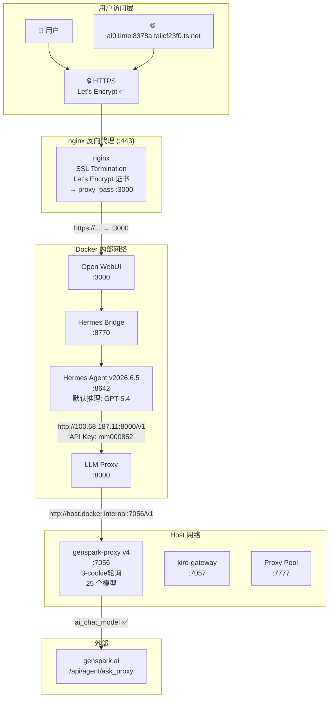
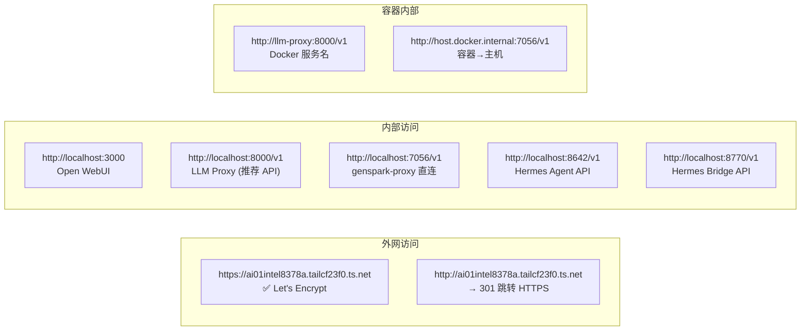
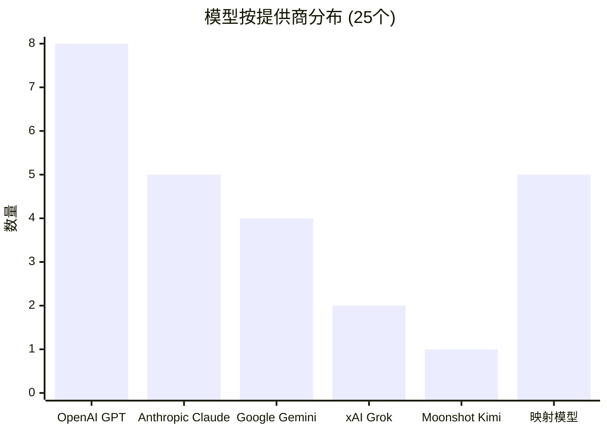
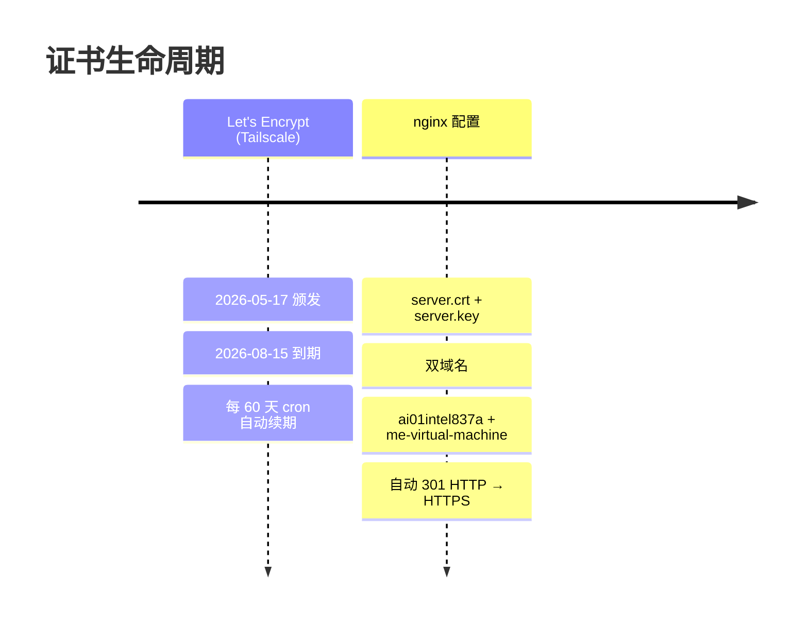

# OpenDeepSeek 完整配置报告

## 系统架构



## 数据流

```
用户 → HTTPS (443, Let's Encrypt)
     → nginx → Open WebUI (:3000)
         → Hermes Bridge (:8770, 智能路由+记忆+搜索)
             → Hermes Agent v2026.6.5 (:8642, 默认模型: GPT-5.4)
                 → LLM Proxy (:8000, API Key: mm000852)
                     → genspark-proxy v4 (:7056, 3-cookie轮询, 25个模型)
                         → model mapping → ai_chat_model
                             → genspark.ai (/api/agent/ask_proxy)
```

## 配置详情

### .env 关键值
```
API地址:        http://100.68.187.11:8000/v1
API密钥:        mm000852
默认模型:       GPT-5.4
高级模型:       GPT-5.5 Pro
```

### Hermes Agent 环境变量
```
OPDS_LLM_BASE_URL=http://100.68.187.11:8000/v1
DEEPSEEK_API_BASE=http://100.68.187.11:8000/v1
OPENAI_BASE_URL=http://100.68.187.11:8000/v1
CUSTOM_MODEL_BASE_URL=http://100.68.187.11:8000/v1

OPDS_LLM_API_KEY=mm000852
DEEPSEEK_API_KEY=mm000852
OPENAI_API_KEY=mm000852
CUSTOM_MODEL_API_KEY=mm000852

OPDS_LLM_MODEL=GPT-5.4
OPDS_LLM_PRO_MODEL=GPT-5.5 Pro
DEFAULT_MODEL=GPT-5.4
CUSTOM_MODEL_NAME=GPT-5.4
HERMES_DEFAULT_MODEL=GPT-5.4
```

## 全部 API 端点



| 端点 | 说明 | API 密钥 |
|------|------|---------|
| `http://localhost:8000/v1` | LLM Proxy (推荐) | mm000852 |
| `http://localhost:7056/v1` | genspark-proxy 直连 | mm000852 |
| `http://localhost:8642/v1` | Hermes Agent API | mm000852 |
| `http://localhost:8770/v1` | Hermes Bridge API | mm000852 |
| `http://100.68.187.11:8000/v1` | Tailscale 网络访问 | mm000852 |
| `https://ai01intel8378a.tailcf23f0.ts.net` | Open WebUI (HTTPS) | 浏览器免密 |

## 全部 IP 地址

| 接口 | IP | 说明 |
|------|-----|------|
| Tailscale | 100.68.187.11 | 主网络 |
| Docker bridge | 172.17.0.1 | 主机网关 |
| 局域网 | 172.17.127.72 | 内网IP |

## 25 个可调用模型



| # | 模型名 | 提供商 | 内部引擎 | 身份识别 |
|---|--------|--------|---------|---------|
| 1 | **GPT-5.4** ⭐ | OpenAI | gpt-5.4 | ✅ "OpenAI AI助手" |
| 2 | GPT-5.5 | OpenAI | gpt-5.5 | ✅ "ChatGPT" |
| 3 | GPT-5.4 Mini | OpenAI | gpt-5.4-mini | ✅ "GPT-5.4 Mini" |
| 4 | GPT-5.4 Nano | OpenAI | gpt-5.4-nano | ✅ "GPT" |
| 5 | GPT-5.2 Pro | OpenAI | gpt-5.2-pro | ✅ "GPT-5.2 Pro" |
| 6 | GPT-5.4 Pro | OpenAI | gpt-5.4-pro | ✅ "GPT-5.4 Pro" |
| 7 | GPT-5.5 Pro | OpenAI | gpt-5.5 | ✅ "GPT-5.5" |
| 8 | O3-pro | OpenAI | o3-pro | ✅ "O3 Pro" |
| 9 | ClaudeSonnet 4.6 | Anthropic | claude-sonnet-4-6 | ✅ "Claude Sonnet 4.6" |
| 10 | Claude Opus 4.8 | Anthropic | claude-opus-4-7 | ✅ "Claude" |
| 11 | Claude Opus 4.7 | Anthropic | claude-opus-4-7 | ✅ "Claude" |
| 12 | Claude Opus 4.6 | Anthropic | claude-opus-4-6 | ✅ "Claude" |
| 13 | Claude Haiku 4.5 | Anthropic | claude-4-5-haiku | ✅ "Claude Haiku 4.5" |
| 14 | Gemini 3 Flash Preview | Google | gemini-3-flash-preview | ✅ "Gemini" |
| 15 | Gemini 3.1 Pro Preview | Google | gemini-3.1-pro-preview | ✅ "Gemini 3.1 Pro" |
| 16 | Gemini 3.1 Flash Lite | Google | gemini-2.5-flash | ✅ "Google训练" |
| 17 | Gemini 3.5 Flash | Google | gemini-3-flash-preview | ✅ "Gemini" |
| 18 | DeepSeek V4 Pro | → GPT-5.5 ⚠️ | gpt-5.5 | ✅ "GPT-5.5" |
| 19 | DeepSeek V4 Flash | → GPT-5.4 Mini ⚠️ | gpt-5.4-mini | ✅ "GPT-5.4 Mini" |
| 20 | Trinity Large Thinking | → Claude 4.6 ⚠️ | claude-opus-4-6 | ✅ "Claude" |
| 21 | Minimax M2.7 | → Gemini 2.5 ⚠️ | gemini-2.5-pro | ✅ "Google训练" |
| 22 | Minimax M3 | → Gemini 3.1 Pro ⚠️ | gemini-3.1-pro-preview | ✅ "Gemini 3.1 Pro" |
| 23 | Kimi K2.6 | Moonshot | groq-kimi-k2-instruct | ✅ "Kimi" |
| 24 | Grok 4.20 Reasoning | xAI | grok-4.20-0309-reasoning | ✅ "Grok 4.20" |
| 25 | Grok 4.20 | xAI | grok-4.20-0309-non-reasoning | ✅ "Grok 4.20" |

## 服务端口表

| 服务 | 端口 | 网络 | 状态 | 用途 |
|------|------|------|------|------|
| nginx (HTTPS) | :443 | host | ✅ | Let's Encrypt 证书 |
| nginx (HTTP→HTTPS) | :80 | host | ✅ | 301 重定向 |
| Open WebUI | :3000 | bridge | ✅ | 前端页面 |
| Hermes Bridge | :8770 | bridge | ✅ | 智能路由 |
| Hermes Agent (v2026.6.5) | :8642 | bridge | ✅ | Agent 执行 |
| LLM Proxy | :8000 | bridge | ✅ | API 推荐端点 |
| genspark-proxy | :7056 | host | ✅ | 核心代理 |
| kiro-gateway | :7057 | bridge | ✅ | 备用路由 |
| proxy-pool | :7777 | bridge | ⚠️ | 代理池 |
| BigBat (旧) | :7055 | host | ⏸️ | 废弃 |
| genspark2api (旧) | :7059 | host | ⏸️ | 废弃 |

## SSL 证书



## 使用教程

### HTTPS 访问

```
打开浏览器 → https://ai01intel8378a.tailcf23f0.ts.net
            ↓
      Let's Encrypt 证书 ✅
            ↓
      Open WebUI 界面
            ↓
      选择模型 → 发送消息 → 回显
```

### API 调用 (OpenAI 兼容)

```python
import openai
client = openai.OpenAI(
    api_key="mm000852",
    base_url="http://100.68.187.11:8000/v1"
)

# 聊天
response = client.chat.completions.create(
    model="GPT-5.4",
    messages=[{"role": "user", "content": "你好"}]
)
print(response.choices[0].message.content)

# 流式
stream = client.chat.completions.create(
    model="GPT-5.5 Pro",
    messages=[{"role": "user", "content": "你好"}],
    stream=True
)
for chunk in stream:
    print(chunk.choices[0].delta.content or "", end="")
```

```bash
# 命令行
curl -X POST http://localhost:8000/v1/chat/completions \
  -H "Authorization: Bearer mm000852" \
  -H "Content-Type: application/json" \
  -d '{"model":"GPT-5.4","messages":[{"role":"user","content":"你好"}],"stream":false}'

# 流式
curl -X POST http://localhost:8000/v1/chat/completions \
  -H "Authorization: Bearer mm000852" \
  -H "Content-Type: application/json" \
  -d '{"model":"GPT-5.4","messages":[{"role":"user","content":"你好"}],"stream":true}'

# 列出模型
curl -H "Authorization: Bearer mm000852" http://localhost:8000/v1/models
```

### Telegram Bot

```
1. Telegram 搜索 @ai4070hermesbot
2. 发送 /start
3. 直接发消息 → Hermes Agent 回复
4. 默认使用 GPT-5.4
```

## 故障排查

| 问题 | 原因 | 解决 |
|------|------|------|
| 证书不匹配 | 访问域名与证书域名不同 | 使用 `ai01intel8378a.tailcf23f0.ts.net` |
| 429 速率限制 | Genspark Lite 15次/分钟 | 等待 300 秒后重试 |
| 无流式回显 | SSE 格式错误 | 已修复 (v4 async generator) |
| 模型返回身份错误 | action_params.model 被忽略 | 已修复 (ai_chat_model) |

## 重启命令

```bash
cd /root/opendeepseek
docker compose up -d                              # 全部启动
docker compose restart llm-proxy hermes hermes-bridge  # 重启核心服务
systemctl restart nginx                            # 重启 HTTPS 代理
tailscale serve --https=443 off                    # 关闭 tailscale 443 (使用 nginx)
tailscale cert --min-validity=24h ai01intel8378a.tailcf23f0.ts.net  # 手动续证书
```

## 汇总清单

### 域名
| 域名 | 用途 | 证书 |
|------|------|------|
| `ai01intel8378a.tailcf23f0.ts.net` | Open WebUI HTTPS 访问 | Let's Encrypt ✅ |
| `me-virtual-machine` | 本地备用域名 | Let's Encrypt ✅ |

### IP 地址
| IP | 接口 | 说明 |
|----|------|------|
| `100.68.187.11` | Tailscale | 主网络，外网 API 访问 |
| `172.17.127.72` | 局域网 | 内网访问 |
| `172.17.0.1` | Docker bridge | 容器网关 |
| `127.0.0.1` | 本地回环 | 本地服务 |

### 端口
| 端口 | 服务 | 协议 | 网络 |
|------|------|------|------|
| 443 | nginx HTTPS (Let's Encrypt) | HTTPS | host |
| 80 | nginx HTTP→301→HTTPS | HTTP | host |
| 3000 | Open WebUI | HTTP | bridge |
| 8000 | LLM Proxy (推荐API端点) | HTTP | bridge |
| 7056 | genspark-proxy v4 | HTTP | host |
| 8642 | Hermes Agent v2026.6.5 | HTTP | bridge |
| 8770 | Hermes Bridge | HTTP | bridge |
| 7057 | kiro-gateway (备用) | HTTP | bridge |
| 7777 | proxy-pool (代理池) | HTTP | bridge |

### API 地址
| 端点 | 说明 |
|------|------|
| `http://localhost:8000/v1` | 推荐 API 入口 |
| `http://localhost:7056/v1` | genspark-proxy 直连 |
| `http://localhost:8642/v1` | Hermes Agent API |
| `http://localhost:8770/v1` | Hermes Bridge API |
| `http://100.68.187.11:8000/v1` | Tailscale 全网访问 |
| `https://ai01intel8378a.tailcf23f0.ts.net` | Open WebUI HTTPS |

### API 密钥
| 密钥 | 用途 | 所在文件 |
|------|------|---------|
| `mm000852` | 全部 API 访问 | `.env` `docker-compose.yml` |
| `mm000852` | Hermes 内部认证 | `.env` |
| `mm000852` | LLM Proxy 认证 | `.env` |
| `mm000852` | genspark-proxy 认证 | `.env` |

### GS_COOKIE（3 个轮询）
```
X-CSRF-Token: （3 组，在 .env 中配置）
Cookie: （3 组，在 .env 中配置）
```

## 已知问题

1. **Hermes Agent** 默认模型为 GPT-5.4，API 请求中的 model 参数仅作为标识返回，不影响实际推理模型
2. **QQ Bot** WebSocket 断连 (code 4009)，需 Hermes 上游修复
3. **代理池** lajiao 代理不支持 TLS，当前直连工作正常
4. **DeepSeek/Trinity/Minimax** 在 genspark 无原生模型，已映射到替代
