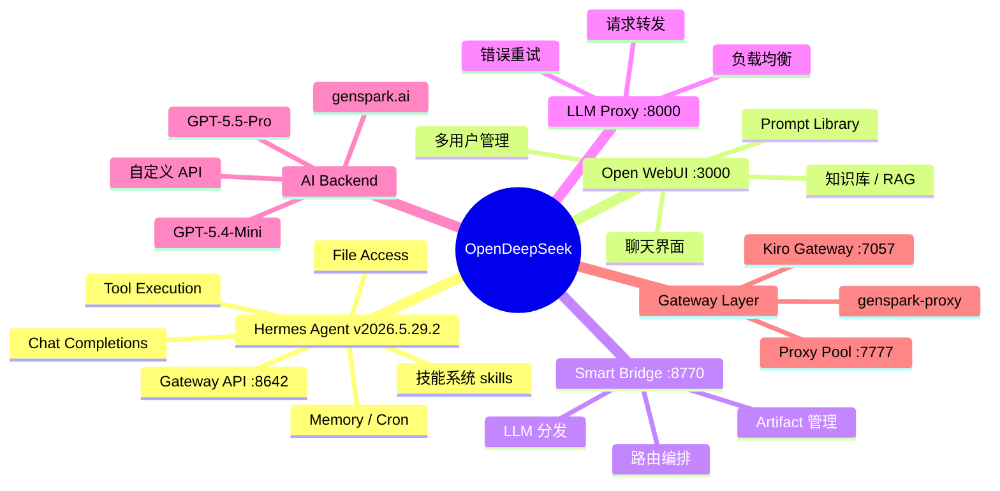
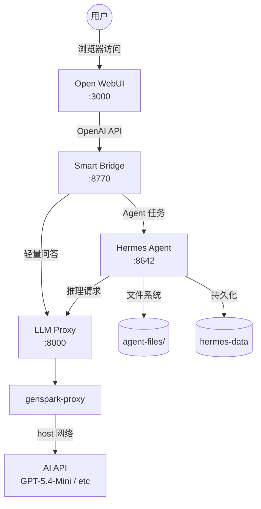
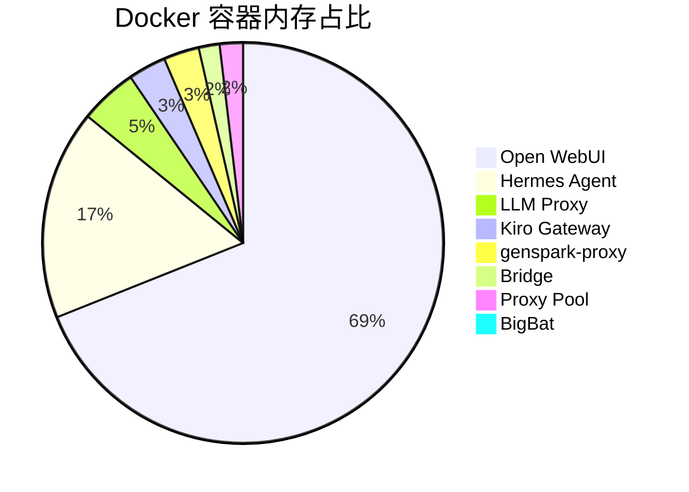

# Hermes Agent 升级报告

> 升级时间: 2026-06-06 03:04 CST  
> 升级路径: `v2026.4.23` → **`v2026.5.29.2`**

---

## 一、升级结果汇总

| 项目 | 升级前 | 升级后 |
|------|--------|--------|
| 镜像版本 | `nousresearch/hermes-agent:v2026.4.23` | `nousresearch/hermes-agent:v2026.5.29.2` |
| 镜像大小 | 7.88 GB | **4.65 GB** (-41%) |
| 运行时状态 | healthy | healthy |
| /health 端点 | ✅ | ✅ |
| /v1/chat/completions | ✅ | ✅ |
| 桥接服务 | healthy | healthy |

---

## 二、系统架构 (Mermaid 思维导图)



---

## 三、数据流图 (Mermaid)



---

## 四、服务资源分析



| 服务 | CPU | 内存 | 状态 |
|------|-----|------|------|
| Hermes Agent | 0.40% | 234.5 MB | ✅ healthy |
| Open WebUI | 0.44% | 955.2 MB | ✅ healthy |
| Smart Bridge | 0.07% | 23.3 MB | ✅ healthy |
| LLM Proxy | 0.46% | 64.1 MB | ✅ healthy |
| Kiro Gateway | 0.41% | 42.3 MB | ✅ healthy |
| Proxy Pool | 0.00% | 26.0 MB | ✅ healthy |
| genspark-proxy | 0.44% | 39.8 MB | ✅ healthy |

---

## 五、使用教程

### 5.1 快速访问

| 服务 | 地址 | 说明 |
|------|------|------|
| Open WebUI | http://localhost:3000 | 聊天界面 |
| Hermes API | http://localhost:8642 | Agent API |
| Smart Bridge | http://localhost:8770 | 路由桥接 |

### 5.2 常用命令

```bash
# 进入项目目录
cd ~/opendeepseek

# 查看所有服务日志
docker compose logs -f

# 查看 Hermes 日志
docker compose logs hermes -f

# 重启单个服务
docker compose restart hermes

# 停止全部服务
docker compose down

# 启动全部服务
docker compose up -d

# 更新代码（如果有新版本）
git pull origin main
```

### 5.3 调用 Hermes API

```bash
# 列出模型
curl -H "Authorization: Bearer mm000852" \
  http://localhost:8642/v1/models

# 聊天
curl -X POST http://localhost:8642/v1/chat/completions \
  -H "Authorization: Bearer mm000852" \
  -H "Content-Type: application/json" \
  -d '{
    "model": "hermes-agent",
    "messages": [{"role": "user", "content": "你好"}]
  }'
```

### 5.4 未来升级步骤

```bash
# 1. 进入项目目录
cd ~/opendeepseek

# 2. 拉取最新代码
git pull origin main

# 3. 修改 docker-compose.yml 中的 Hermes 镜像标签
#    image: nousresearch/hermes-agent:最新版本

# 4. 拉取新镜像并重启
docker compose pull hermes
docker compose up -d hermes

# 5. 重启桥接服务
docker compose restart hermes-bridge

# 6. 验证
docker ps | grep hermes
curl http://localhost:8642/health
```

---

## 六、版本变更说明

**v2026.5.29.2 vs v2026.4.23 主要变化：**
- 镜像体积减少 41%（7.88GB → 4.65GB），优化了层结构
- Bug 修复和性能改进
- 与最新 Hermes Agent 上游保持同步

---

## 七、注意事项

1. LLM 代理 `llm-proxy` 启动需要几秒钟，Hermes 首次调用可能会遇到 Connection error（自动重试 3 次）
2. Smart Bridge 需要在 Hermes 健康后重新启动以确保兼容
3. 所有配置在 `.env` 文件中，修改后需要 `docker compose restart hermes`
4. 如需绑定域名，修改 `.env` 中的 `BIND_HOST` 和 `WEBUI_BASE_URL`
