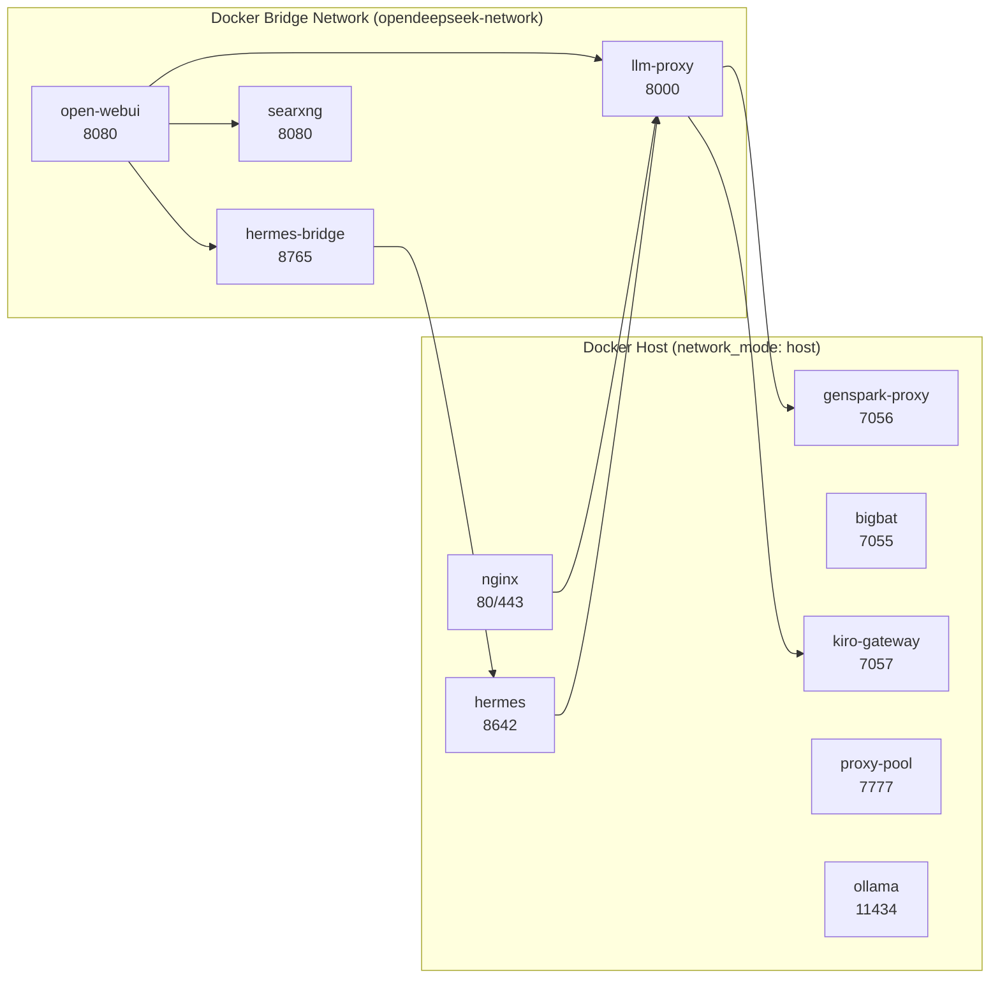
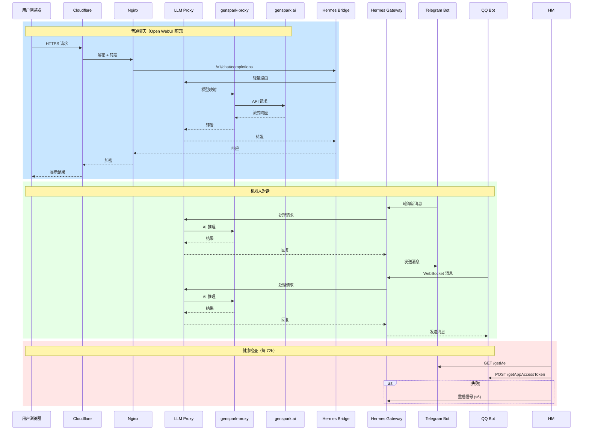
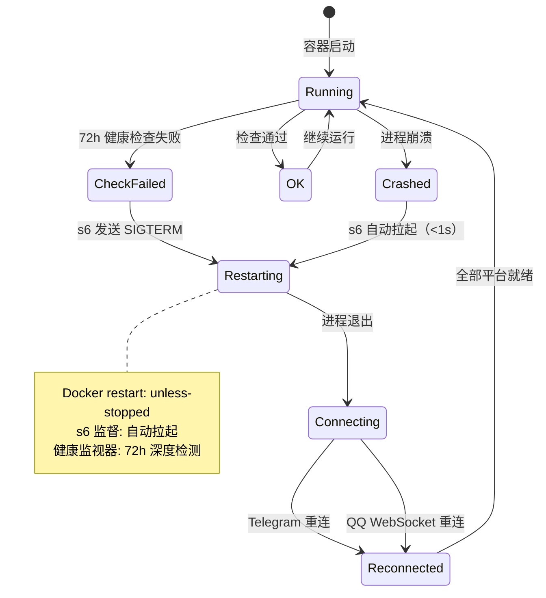
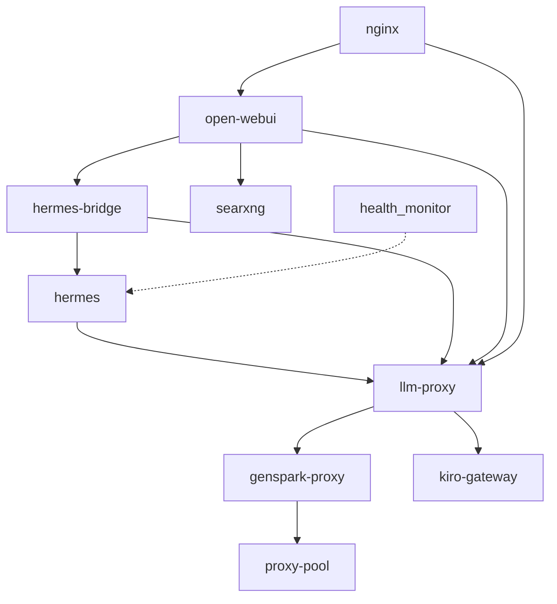
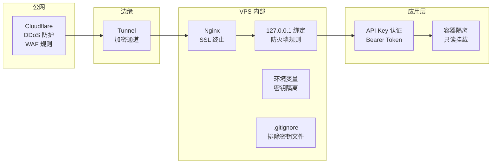

# 🏗️ 系统架构文档

> 完整架构说明：容器拓扑、数据流、网络策略、自动修复机制

---

## 一、网络拓扑

```mermaid
graph TB
    subgraph Internet
        USERS[用户浏览器 / 手机]
        TG[Telegram API<br/>api.telegram.org]
        QQ[QQ Bot API<br/>api.sgroup.qq.com]
    end

    subgraph DNS
        CNAME[CNAME 记录<br/>domain → tunnel-id.cfargotunnel.com]
        CF_IP[Cloudflare Edge<br/>104.21.46.97<br/>172.67.137.88]
    end

    subgraph VPS_SERVER["VPS 服务器 (38.252.8.200)"]
        subgraph NET["网络层"]
            direction LR
            WARP["sing-box WARP<br/>WireGuard 隧道<br/>allowed_ips: 0.0.0.0/0"]
            TUN["cloudflared tunnel<br/>ID: 5363ecdd"]
            NGINX_SYS["system nginx<br/>端口 14333"]
        end

        subgraph DOCKER["Docker 容器"]
            NGINX_D["🐳 nginx<br/>80 / 443 SSL"]
            
            subgraph FRONTEND["前端层"]
                WEBUI["Open WebUI<br/>端口 3000<br/>UI / 知识库 / 多模态"]
                ONBOARD["Onboarding Portal<br/>端口 7070"]
            end

            subgraph GATEWAY["网关层"]
                HERMES["Hermes Gateway<br/>端口 8642<br/>Telegram + QQ Bot"]
                BRIDGE["Smart Bridge<br/>端口 8770<br/>路由 + OCR"]
                LLMPROXY["LLM Proxy<br/>端口 8000<br/>模型映射]
            end

            subgraph UPSTREAM["上游代理层"]
                GSPARK["genspark-proxy<br/>端口 7056<br/>→ genspark.ai"]
                KIRO["kiro-gateway<br/>端口 7057<br/>多模型路由"]
                POOL["proxy-pool<br/>端口 7777"]
            end

            subgraph MONITOR["运维层"]
                HEALTH["🩺 health_monitor<br/>72h 循环检测"]
                OLLAMA["ollama<br/>端口 11434"]
            end
        end
    end

    USERS -->|https://domain.com| CNAME
    CNAME --> CF_IP
    CF_IP -->|TLS 隧道| TUN
    TUN --> NGINX_D
    NGINX_D -->|/v1/*| LLMPROXY
    NGINX_D -->|/*| WEBUI
    TG -->|polling| HERMES
    QQ -->|wss://| HERMES
    WEBUI --> BRIDGE --> HERMES
    WEBUI --> LLMPROXY
    HERMES --> LLMPROXY
    
    LLMPROXY --> GSPARK
    LLMPROXY --> KIRO
    GSPARK -->|HTTP| WARP -->|加密| INTERNET
    
    subgraph INTERNET["互联网"]
        GENSPARK["genspark.ai<br/>上游 AI API"]
    end
    
    HEALTH -.->|每 72h| HERMES
    HEALTH -.->|掉线重启| TUN
```

---

## 二、容器拓扑



---

## 三、数据流



---

## 四、自动修复流程



---

## 五、端口映射表

| 端口 | 服务 | 协议 | 绑定 | 说明 |
|------|------|------|------|------|
| 80 | Nginx | HTTP | host | Cloudflare 代理入口 |
| 443 | Nginx | HTTPS/SSL | host | Cloudflare 代理入口 |
| 3000 | Open WebUI | HTTP | 0.0.0.0 | 用户界面 |
| 8000 | LLM Proxy | HTTP | 127.0.0.1 | OpenAI 兼容 API |
| 8642 | Hermes Gateway | HTTP | host | Agent API |
| 8770 | Hermes Bridge | HTTP | 127.0.0.1 | Smart Bridge |
| 7056 | genspark-proxy | HTTP | host | 上游代理 |
| 7057 | kiro-gateway | HTTP | 127.0.0.1 | 多模型路由 |
| 7777 | proxy-pool | HTTP | host | 代理池 |
| 11434 | ollama | HTTP | host | 本地 LLM |
| 14333 | system nginx | HTTP | host | sing-box 内部 |

---

## 六、镜像依赖图



---

## 七、安全边界



---

## 八、技术栈

| 层 | 技术 | 版本 |
|----|------|------|
| 运行时 | Python 3.13 | 容器内 |
| 容器编排 | Docker Compose | v2 |
| 反向代理 | nginx | latest |
| 隧道 | cloudflared | latest |
| 代理/VPN | sing-box + WARP | latest |
| Agent 框架 | Hermes Agent | v2026.6.5 |
| AI 代理 | genspark-proxy | 自制 |
| 多模型路由 | kiro-gateway | v0.8 |
| 用户界面 | Open WebUI | latest |
| 搜索引擎 | SearXNG | latest |
| 本地 LLM | ollama | latest |
