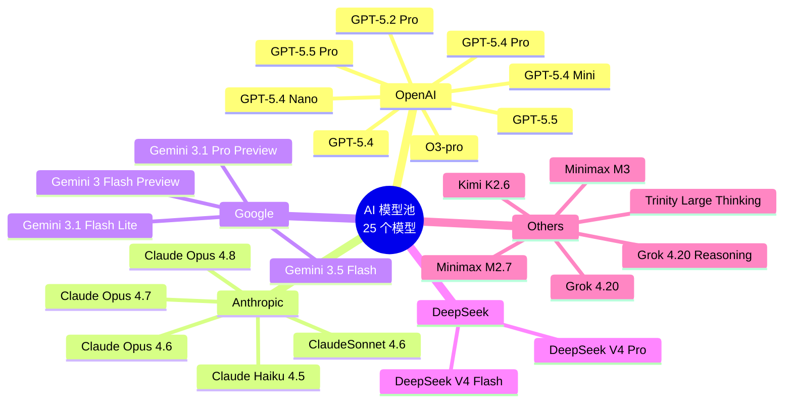
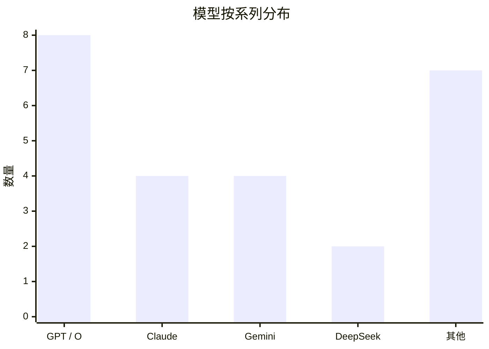
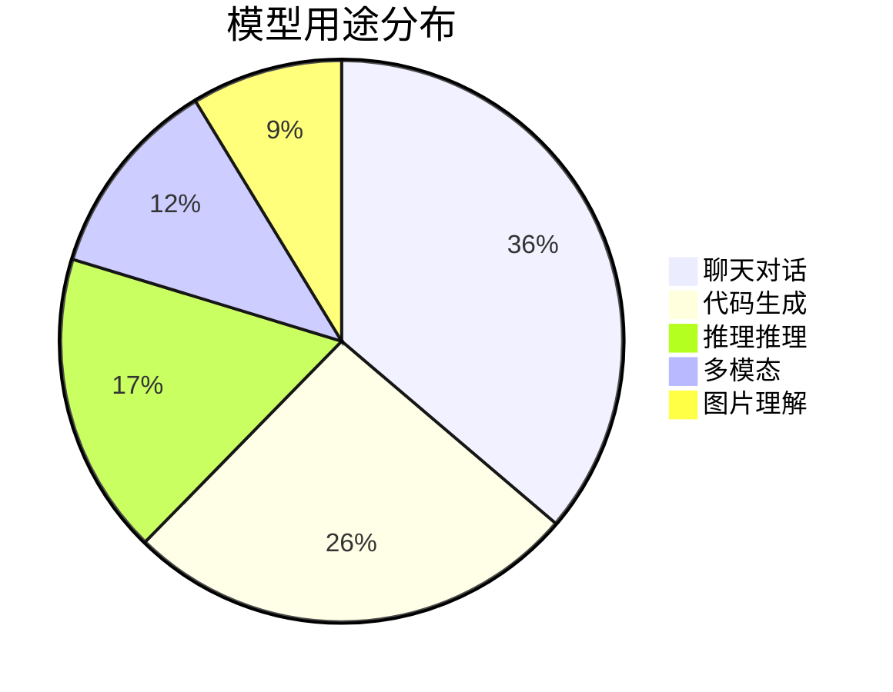
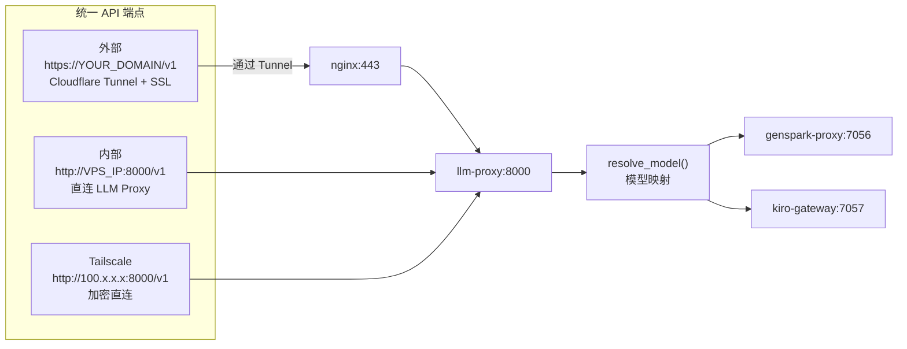

# 🤖 AI 模型汇总表

> 完整列出所有可用 AI 模型的名称、系列、上游提供商、API 端点

---

## 一、所有模型一览

---

## 二、模型分类统计

---

## 三、详细模型表

| 序号 | 系列 | 模型 ID | 最佳用途 | 备注 |
|:----:|:----:|---------|----------|------|
| 1 | **GPT** | `GPT-5.4` | 日常聊天、快速响应 | 🏆 默认模型 |
| 2 | **GPT** | `GPT-5.5` | 深度对话 | |
| 3 | **GPT** | `GPT-5.4 Mini` | 轻量任务 | 最省 token |
| 4 | **GPT** | `GPT-5.4 Nano` | 极速响应 | 最低延迟 |
| 5 | **GPT** | `GPT-5.2 Pro` | 专业写作 | |
| 6 | **GPT** | `GPT-5.4 Pro` | 复杂推理 | |
| 7 | **GPT** | `GPT-5.5 Pro` | 最高质量 | 🏆 Pro 默认 |
| 8 | **O** | `O3-pro` | 科学推理 | |
| 9 | **Claude** | `ClaudeSonnet 4.6` | 代码生成 | |
| 10 | **Claude** | `Claude Opus 4.8` | 长文写作 | |
| 11 | **Claude** | `Claude Opus 4.7` | 分析报告 | |
| 12 | **Claude** | `Claude Opus 4.6` | 通用 | |
| 13 | **Claude** | `Claude Haiku 4.5` | 快速问答 | |
| 14 | **Gemini** | `Gemini 3 Flash Preview` | 多模态 | |
| 15 | **Gemini** | `Gemini 3.1 Pro Preview` | 长上下文 | |
| 16 | **Gemini** | `Gemini 3.1 Flash Lite` | 轻量多模态 | |
| 17 | **Gemini** | `Gemini 3.5 Flash` | 视频理解 | |
| 18 | **DeepSeek** | `DeepSeek V4 Pro` | 推理任务 | |
| 19 | **DeepSeek** | `DeepSeek V4 Flash` | 低成本 | 最便宜 |
| 20 | **Arcee** | `Trinity Large Thinking` | 深度推理 | |
| 21 | **MiniMax** | `Minimax M2.7` | 中文对话 | |
| 22 | **MiniMax** | `Minimax M3` | 创意写作 | |
| 23 | **Kimi** | `Kimi K2.6` | 长文阅读 | |
| 24 | **xAI** | `Grok 4.20 Reasoning` | 深度推理 | |
| 25 | **xAI** | `Grok 4.20` | 实时问答 | |

---

## 四、API 端点

| 端点 | URL | 用途 | 认证 |
|------|-----|------|------|
| **外部 HTTPS** | `https://YOUR_DOMAIN/v1` | 公网访问 | Bearer Token |
| **内部 HTTP** | `http://VPS_IP:8000/v1` | 局域网直连 | Bearer Token |
| **Tailscale** | `http://100.x.x.x:8000/v1` | 加密直连 | Bearer Token |
| **Hermes 网关** | `http://127.0.0.1:8642/v1` | Agent 内部 | Bearer Token |

---

## 五、网络配置

| 域名/IP | 端口 | 服务 | 协议 | 方向 |
|---------|------|------|------|------|
| `usapi.1001001.best` | 443 | Cloudflare Tunnel 入口 | HTTPS | 入站 |
| `VPS_PUBLIC_IP` | 80/443 | Nginx 反向代理 | HTTP/HTTPS | 入站 |
| `127.0.0.1` | 8000 | LLM Proxy | HTTP | 内部 |
| `127.0.0.1` | 7056 | genspark-proxy | HTTP | 内部 |
| `127.0.0.1` | 7057 | kiro-gateway | HTTP | 内部 |
| `api.telegram.org` | 443 | Telegram Bot API | HTTPS | 出站 |
| `bots.qq.com` | 443 | QQ Bot Token API | HTTPS | 出站 |
| `api.sgroup.qq.com` | 443 | QQ Bot WebSocket | WSS | 出站 |
| `genspark.ai` | 443 | AI 模型上游 | HTTPS | 出站（经 WARP） |

---

## 六、API 密钥汇总

| 密钥名称 | 用途 | 配置文件 |
|----------|------|---------|
| `OPDS_LLM_API_KEY` | 所有 API 调用的主密钥 | `.env` |
| `API_SECRET` | genspark-proxy 认证 | `.env` |
| `GS_COOKIE` | GenSpark AI 会话 Cookie | `.env` |
| `TELEGRAM_BOT_TOKEN` | Telegram 机器人 | `.env` |
| `QQ_APP_ID` | QQ 机器人 AppID | `.env` |
| `QQ_CLIENT_SECRET` | QQ 机器人密钥 | `.env` |
| `KIRO_REFRESH_TOKEN` | Kiro 网关刷新令牌 | `.env` |
| `WEBUI_SECRET_KEY` | Open WebUI 会话密钥 | `.env` |
| `HERMES_API_KEY` | Hermes Agent 网关 | `.env` |
| `searxng secret_key` | SearXNG 内部密钥 | `searxng/settings.yml` |
| `hermes/api_key` | Hermes 配置 | `hermes/config.yaml` |

> ⚠️ **安全提醒**：以上所有密钥均已被 `.gitignore` 排除，不会提交到 GitHub。
> 部署新 VPS 时，需要通过 `install.sh` 的交互式向导填写。
