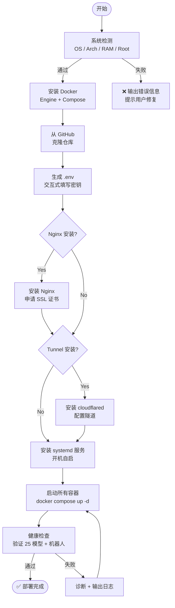
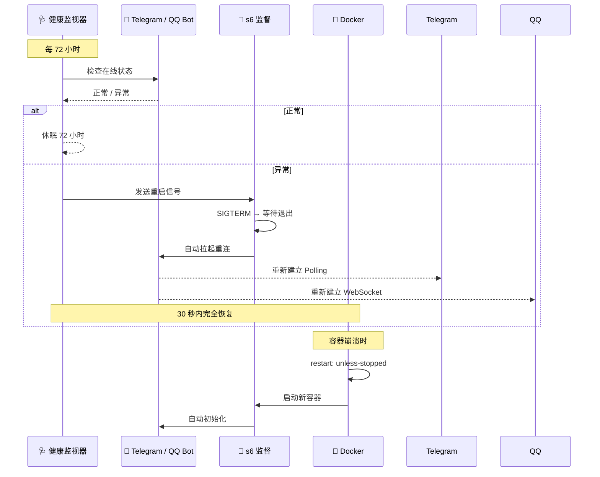

# 📦 新 VPS 完整部署教程

> 从零开始，在新 VPS 上部署完整 OpenDeepSeek 平台

---

## 一、前提条件

| 要求 | 说明 |
|------|------|
| VPS | 2 核 / 4GB+ RAM / 20GB+ 磁盘 |
| 系统 | Ubuntu 22.04+ / Debian 12+ / CentOS 8+ |
| 网络 | 公网 IP，开放 80/443 端口 |
| 域名 | 可选（用于 HTTPS/Tunnel） |

---

## 二、一键部署

### 方式一：公共仓库（推荐）

```bash
bash <(curl -fsSL https://raw.githubusercontent.com/520mmxx/vpsme/main/install.sh) \
  --domain your-domain.com \
  --email admin@your-domain.com
```

### 方式二：带 GitHub Token（私有仓库）

```bash
export GH_TOKEN="ghp_xxxxxxxxxxxx"
bash <(curl -fsSL "https://${GH_TOKEN}@raw.githubusercontent.com/520mmxx/vpsme/main/install.sh")
```

### 方式三：手动克隆

```bash
git clone https://github.com/520mmxx/vpsme.git
cd vpsme
cp .env.example .env
# 编辑 .env 填入密钥
docker compose up -d
```

---

## 三、安装流程详解



---

## 四、需要准备的密钥

| 密钥 | 用途 | 获取方法 |
|------|------|---------|
| `OPDS_LLM_API_KEY` | 主 API Key | 自己设定，如 `mm000852` |
| `GS_COOKIE` | AI 模型上游会话 | 登录 genspark.ai → F12 → Application → Cookies |
| `TELEGRAM_BOT_TOKEN` | Telegram 机器人 | [@BotFather](https://t.me/BotFather) → `/newbot` |
| `QQ_APP_ID` + `QQ_CLIENT_SECRET` | QQ 机器人 | https://bot.q.qq.com → 创建机器人 |
| `KIRO_REFRESH_TOKEN` | 多模型路由 | kiro-gateway 配置 |
| `WEBUI_SECRET_KEY` | WebUI 会话加密 | 自动生成（或自己设 32 位随机字符串） |

### Telegram Bot 创建步骤

1. 打开 Telegram，搜索 [@BotFather](https://t.me/BotFather)
2. 发送 `/newbot`
3. 输入 bot 名称（如 `MyAIBot`）
4. 输入 bot 用户名（如 `my_ai_bot`）
5. 复制得到的 Token（格式 `123456:ABC-DEF1234ghIkl-zyx57W2v1u123ew11`）
6. 在 `.env` 中填入 `TELEGRAM_BOT_TOKEN`

### QQ Bot 创建步骤

1. 打开 https://bot.q.qq.com
2. 注册开发者 → 创建机器人
3. 获取 `AppID` 和 `AppSecret`
4. 在 `.env` 中填入 `QQ_APP_ID` 和 `QQ_CLIENT_SECRET`

---

## 五、部署后验证

### 验证 API

```bash
# 查看模型列表
curl -s http://127.0.0.1:8000/v1/models \
  -H "Authorization: Bearer your-api-key" | python3 -c "import json,sys;d=json.load(sys.stdin);print(f'{len(d[\"data\"])} models')"

# 测试聊天
curl -s http://127.0.0.1:8000/v1/chat/completions \
  -H "Authorization: Bearer your-api-key" \
  -H "Content-Type: application/json" \
  -d '{"model":"GPT-5.4","messages":[{"role":"user","content":"Say hello"}],"max_tokens":20}'
```

### 验证机器人

```bash
# Telegram Bot
docker exec opendeepseek-hermes python3 -c "
import httpx, os
r = httpx.post(f'https://api.telegram.org/bot{os.environ[\"TELEGRAM_BOT_TOKEN\"]}/getMe')
print('Telegram:', r.json()['result']['username'])
"

# QQ Bot
docker exec opendeepseek-hermes python3 -c "
import httpx, os
r = httpx.post('https://bots.qq.com/app/getAppAccessToken',
    json={'appId': os.environ['QQ_APP_ID'], 'clientSecret': os.environ['QQ_CLIENT_SECRET']})
print('QQ Bot:', 'OK' if r.json().get('access_token') else 'FAIL')
"
```

### 查看健康监视器

```bash
docker exec opendeepseek-hermes tail -5 /opt/data/logs/health_monitor.log
# 应显示: All OK — next check in 72h
```

---

## 六、运维命令

```bash
# 查看所有容器状态
docker ps --format "table {{.Names}}\t{{.Status}}\t{{.Ports}}"

# 查看 Hermes 网关日志
docker logs opendeepseek-hermes --tail 50

# 查看 Telegram 连接状态
docker exec opendeepseek-hermes grep "✓ telegram" /opt/data/logs/gateway.log

# 查看 QQ Bot 连接状态
docker exec opendeepseek-hermes grep "QQBot.*Ready" /opt/data/logs/gateway.log

# 重启 Hermes 容器
docker compose -f /root/opendeepseek/docker-compose.yml restart hermes

# 重启全部服务
docker compose -f /root/opendeepseek/docker-compose.yml restart

# 停止全部服务
docker compose -f /root/opendeepseek/docker-compose.yml down

# 更新代码
cd /root/opendeepseek && git pull && docker compose up -d

# 查看系统资源
docker stats --no-stream

# 查看健康监视器日志
docker exec opendeepseek-hermes cat /opt/data/logs/health_monitor.log
```

---

## 七、开机自启

安装脚本已经自动配置：

| 组件 | 自启方式 | 验证命令 |
|------|---------|---------|
| Docker 服务 | `systemctl enable docker` | `systemctl is-enabled docker` |
| Docker 容器 | `restart: unless-stopped` | `docker inspect --format '{{.HostConfig.RestartPolicy.Name}}' <容器名>` |
| systemd 服务 | `opendeepseek-auto.service` | `systemctl is-enabled opendeepseek-auto.service` |
| s6 进程监督 | 容器内建 | 崩溃自动 < 1 秒拉起 |
| 72h 健康检查 | `health_monitor.py` | 检查 `/opt/data/logs/health_monitor.log` |

---

## 八、自动修复流程



---

## 九、常见问题

### Q: 安装脚本卡住怎么办？
A: 按 `Ctrl+C` 中断，检查网络连接，重新运行。

### Q: Telegram Bot 没反应？
A: 检查 `TELEGRAM_BOT_TOKEN` 是否正确，以及 `/etc/hosts` 中有没有 Telegram 的 DNS 条目。
```bash
# 手动测试
docker exec opendeepseek-hermes curl -s "https://api.telegram.org/bot${TOKEN}/getMe"
```

### Q: QQ Bot 无限重连？
A: 检查 `QQ_APP_ID` 和 `QQ_CLIENT_SECRET` 是否正确：
```bash
docker exec opendeepseek-hermes python3 -c "
import httpx, os
r = httpx.post('https://bots.qq.com/app/getAppAccessToken',
    json={'appId': os.environ['QQ_APP_ID'], 'clientSecret': os.environ['QQ_CLIENT_SECRET']})
print(r.json())
"
```

### Q: 模型调用返回 502？
A: GenSpark Cookie 可能过期。重新登录 genspark.ai，复制新的 Cookie。
```bash
docker compose -f /root/opendeepseek/docker-compose.yml restart genspark-proxy hermes
```

### Q: 如何升级？
A: 进入项目目录，`git pull && docker compose up -d`。
