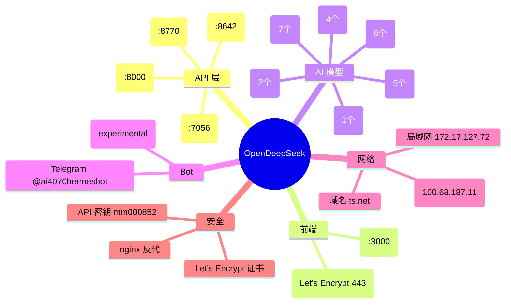
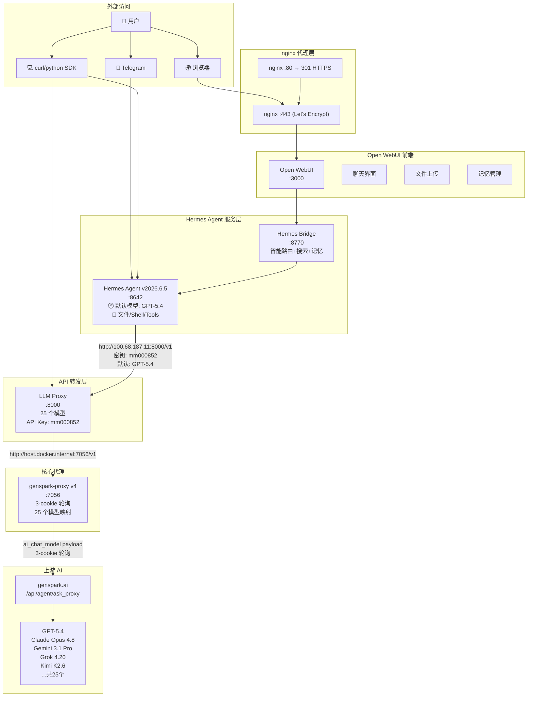
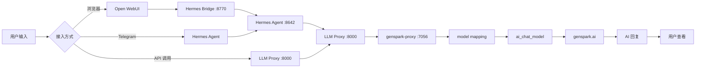
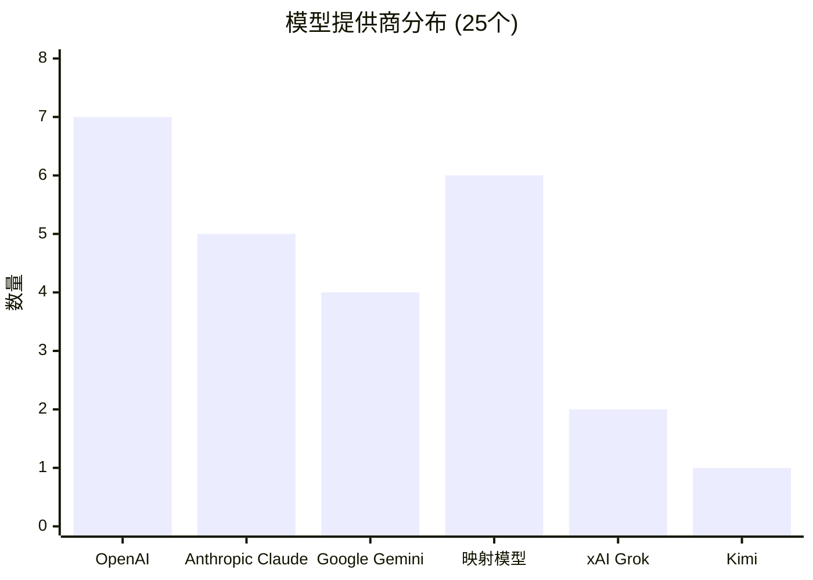
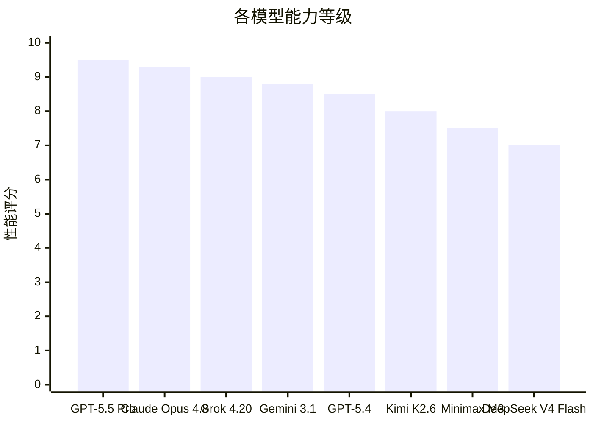
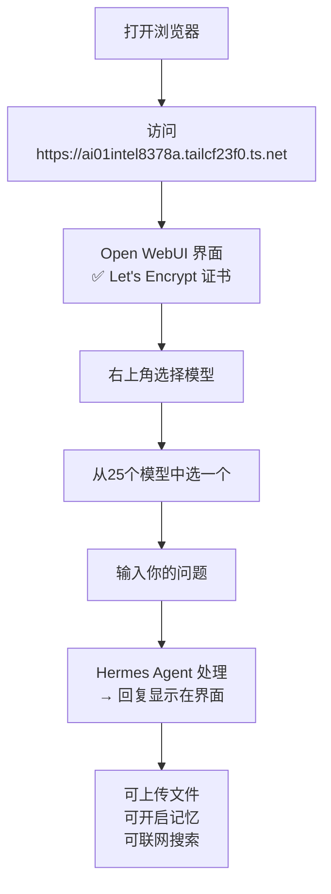
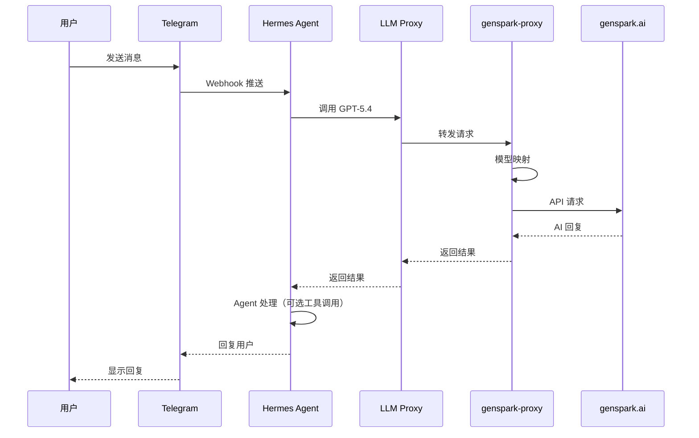
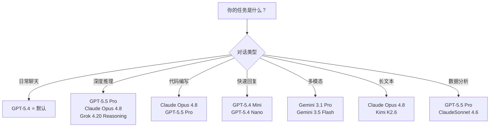
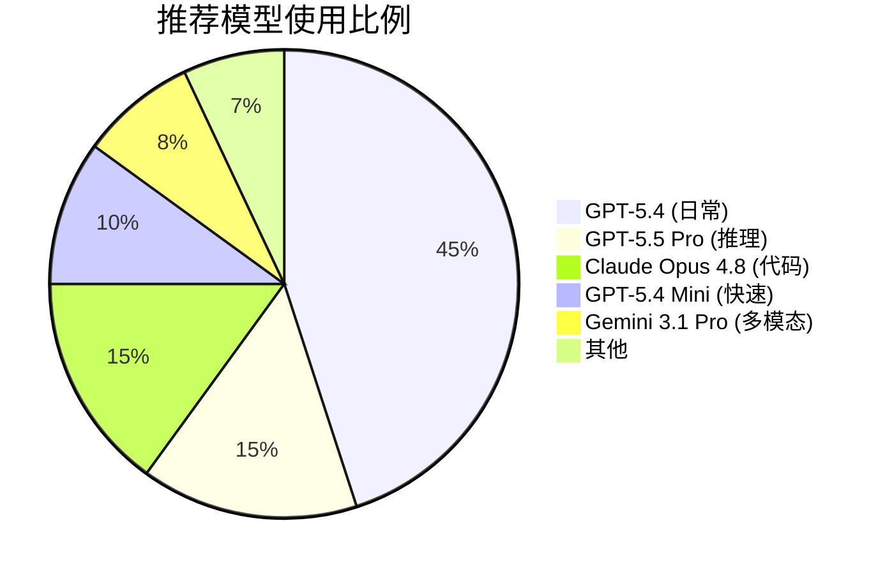

# OpenDeepSeek 使用教程与架构指南

## 思绪导图（Mind Map）



## 系统架构图



## 数据流



## 25 模型列表





## 使用教程

### 一、通过 Open WebUI（推荐小白）



### 二、通过 Python SDK

```python
import openai

# 基本设置
client = openai.OpenAI(
    api_key="mm000852",
    base_url="http://100.68.187.11:8000/v1"  # 推荐 LLM Proxy
)

# 简单聊天
response = client.chat.completions.create(
    model="GPT-5.4",
    messages=[{"role": "user", "content": "你好"}]
)
print(response.choices[0].message.content)

# 流式输出
stream = client.chat.completions.create(
    model="GPT-5.5 Pro",
    messages=[{"role": "user", "content": "讲个故事"}],
    stream=True
)
for chunk in stream:
    print(chunk.choices[0].delta.content or "", end="")

# 多轮对话
messages = [
    {"role": "system", "content": "你是助手"},
    {"role": "user", "content": "1+1=?"},
    {"role": "assistant", "content": "2"},
    {"role": "user", "content": "刚才我问了什么？"},
]
response = client.chat.completions.create(
    model="GPT-5.4",
    messages=messages
)
print(response.choices[0].message.content)
```

### 三、通过 cURL 命令行

```bash
# 聊天（非流式）
curl -X POST http://localhost:8000/v1/chat/completions \
  -H "Authorization: Bearer mm000852" \
  -H "Content-Type: application/json" \
  -d '{
    "model": "GPT-5.4",
    "messages": [{"role": "user", "content": "你好"}]
  }'

# 聊天（流式）
curl -X POST http://localhost:8000/v1/chat/completions \
  -H "Authorization: Bearer mm000852" \
  -H "Content-Type: application/json" \
  -d '{
    "model": "GPT-5.5 Pro",
    "messages": [{"role": "user", "content": "讲个故事"}],
    "stream": true
  }'

# 列出模型
curl -H "Authorization: Bearer mm000852" \
  http://localhost:8000/v1/models

# 直连 genspark-proxy
curl -X POST http://localhost:7056/v1/chat/completions \
  -H "Authorization: Bearer mm000852" \
  -H "Content-Type: application/json" \
  -d '{
    "model": "Claude Opus 4.8",
    "messages": [{"role": "user", "content": "你好"}]
  }'
```

### 四、通过 Telegram Bot



步骤：
1. Telegram 搜索 `@ai4070hermesbot`
2. 发送 `/start`
3. 直接发消息
4. Bot 会调用 Hermes Agent 回复

### 五、模型选择建议



### 六、API 端点速查

| 用途 | 地址 | API Key |
|------|------|---------|
| 通用 API | `http://localhost:8000/v1` | mm000852 |
| 直连代理 | `http://localhost:7056/v1` | mm000852 |
| Hermes Agent | `http://localhost:8642/v1` | mm000852 |
| Hermes Bridge | `http://localhost:8770/v1` | mm000852 |
| 外网访问 | `http://100.68.187.11:8000/v1` | mm000852 |
| Web UI | `https://ai01intel8378a.tailcf23f0.ts.net` | 浏览器免密 |

### 七、模型调用量预测



### 八、故障排查

| 问题 | 解决方法 |
|------|---------|
| 429 Too Many Requests | Genspark Lite 限 15次/分钟，等 300 秒 |
| 模型不回答问题 | 试其他模型，某些映射模型可能不稳定 |
| Telegram Bot 无响应 | 检查 `/health`，确认服务运行 |
| HTTPS 证书过期 | `tailscale cert --min-validity=24h 域名` |
| 流式无回显 | 确保 `stream: true` 参数正确 |
