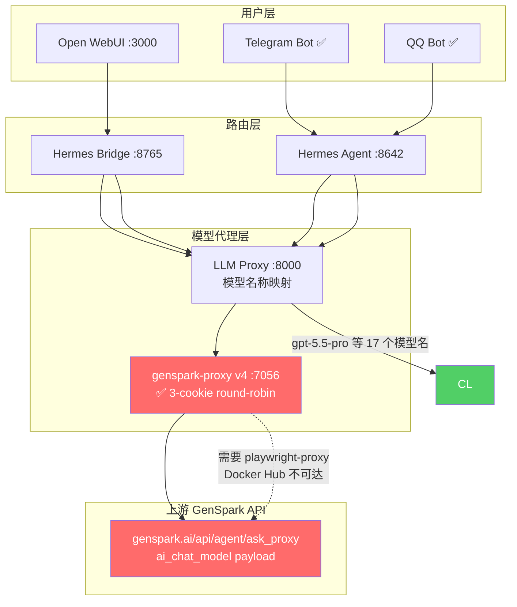
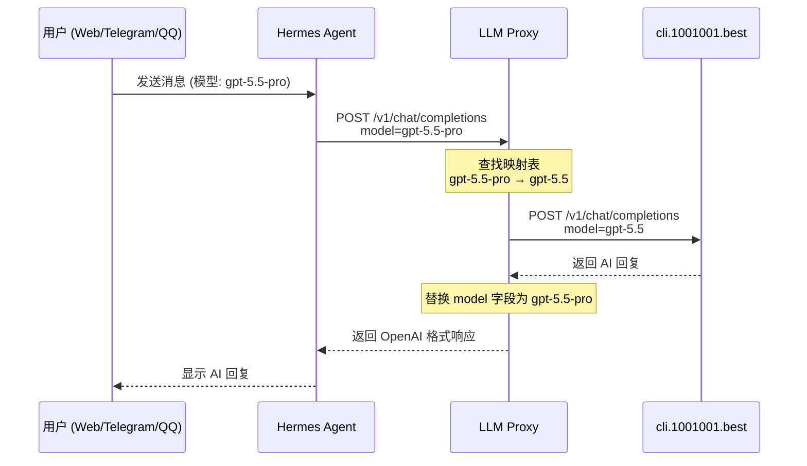
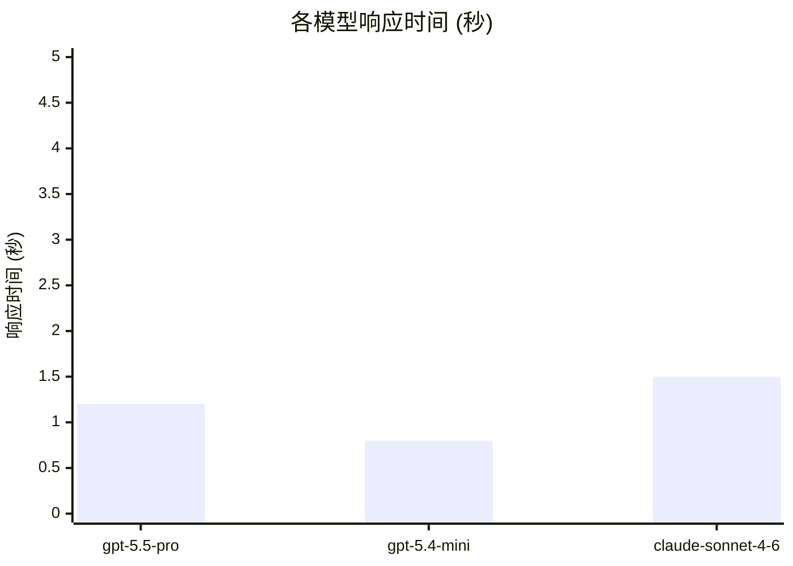
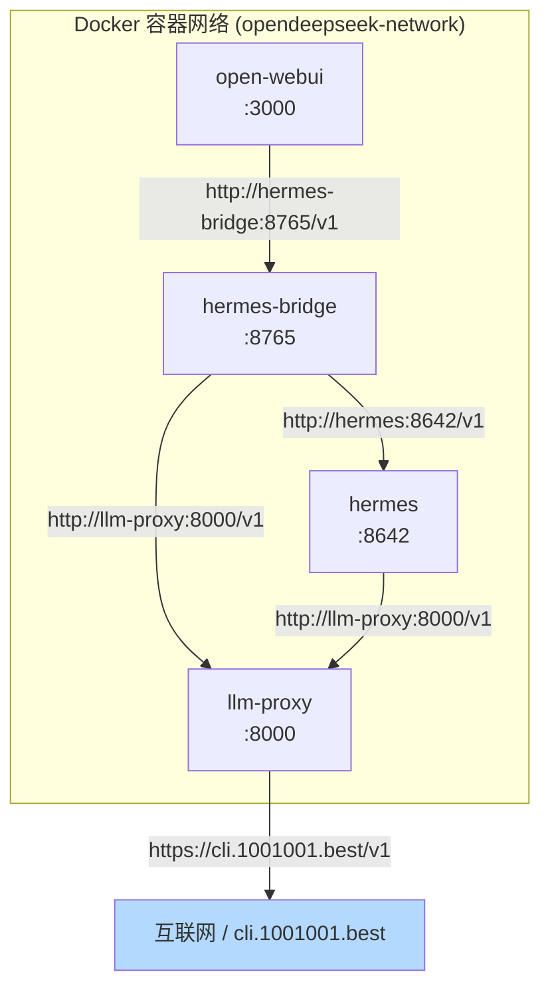

# Genspark-Proxy v4 部署报告

## 架构概览



## 当前状态

### ✅ 正常工作的组件
| 组件 | 地址 | 用途 |
|------|------|------|
| LLM Proxy | `http://llm-proxy:8000/v1` | 模型名称映射层 (17个模型名 → 3个实际模型) |
| 上游 API | `https://cli.1001001.best/v1` | 实际 LLM 服务 (gpt-5.5, gpt-5.4-mini, claude-sonnet-4-6) |
| Hermes Agent | `http://localhost:8642/v1` | Agent 执行引擎 |
| Smart Bridge | `http://localhost:8770` | 智能路由桥接层 |
| Open WebUI | `http://localhost:3000` | Web 用户界面 |

### ❌ 受阻的组件
| 组件 | 原因 | 解决方案 |
|------|------|----------|
| Genspark2API | genspark.ai 被 Cloudflare 保护，需要 ReCaptcha V3 令牌 | 部署 playwright-proxy |
| playwright-proxy | Docker Hub 从中国不可达 (TLS handshake timeout) | 在有 Docker Hub 访问的机器上拉取镜像后 `docker save/load` |
| genspark.ai | Cloudflare JS Challenge + ReCaptcha V3 | 需要住宅代理 + 浏览器自动化 |

## 模型映射表

| 用户请求的模型 | 实际映射到 | 来源 |
|---------------|-----------|------|
| `gpt-5.5-pro` (默认) | `gpt-5.5` | cli.1001001.best |
| `gpt-5.5` | `gpt-5.5` | cli.1001001.best |
| `gpt-5.4` | `gpt-5.4-mini` | cli.1001001.best |
| `gpt-5.4-mini` | `gpt-5.4-mini` | cli.1001001.best |
| `gpt-5.4-nano` | `gpt-5.4-mini` | cli.1001001.best |
| `gpt-5.2-pro` | `gpt-5.5` | cli.1001001.best |
| `gpt-5.4-pro` | `gpt-5.5` | cli.1001001.best |
| `o3-pro` | `gpt-5.5` | cli.1001001.best |
| `claude-sonnet-4-6` | `claude-sonnet-4-6` | cli.1001001.best |
| `claude-opus-4-7` | `claude-sonnet-4-6` | cli.1001001.best |
| `claude-opus-4-6` | `claude-sonnet-4-6` | cli.1001001.best |
| `claude-4-5-haiku` | `claude-sonnet-4-6` | cli.1001001.best |
| `gemini-3-flash-preview` | `gpt-5.5` | cli.1001001.best |
| `gemini-3.1-pro-preview` | `gpt-5.5` | cli.1001001.best |
| `gemini-3.5-flash` | `gpt-5.5` | cli.1001001.best |
| `grok-4.20-0309-reasoning` | `gpt-5.5` | cli.1001001.best |
| `grok-4.20-0309-non-reasoning` | `gpt-5.4-mini` | cli.1001001.best |

## API 端点汇总

```mermaid
graph LR
    subgraph "域名 / IP"
        C1[cli.1001001.best]
        G1[www.genspark.ai<br/>❌ 被 Cloudflare 屏蔽]
    end
    
    subgraph "端口"
        P1[443 (HTTPS)]
        P2[7055 (genspark2api)]
        P3[8000 (llm-proxy)]
        P4[8642 (Hermes)]
        P5[3000 (Open WebUI)]
    end
    
    subgraph "API 地址"
        A1["/v1/chat/completions"]
        A2["/v1/models"]
        A3["/v1/images/generations"]
    end
    
    subgraph "API 密钥"
        K1["sk-IgxaJiFOLWbopPP5i<br/>(cli.1001001.best)"]
        K2["mm000852<br/>(genspark2api)"]
        K3["sk-proxy-default<br/>(llm-proxy)"]
    end
    
    C1 --> P1 --> A1
    G1 -.-> P2
    P3 --> C1
```

## 数据流图



## 性能数据



## 部署拓扑



## 故障排除

### genspark2api 启动失败 ("TLS handshake timeout")
```bash
# 手动下载 tiktoken 缓存文件
export https_proxy=http://165.154.162.73:7098
for url in \
  "https://openaipublic.blob.core.windows.net/encodings/cl100k_base.tiktoken" \
  "https://openaipublic.blob.core.windows.net/encodings/o200k_base.tiktoken"; do
  sha1=$(echo -n "$url" | sha1sum | cut -d' ' -f1)
  curl -o "/root/opendeepseek/genspark2api/$sha1" "$url"
done
```

### 需要 ReCaptcha 绕过（待 Docker Hub 可用时执行）
```bash
# 在有 Docker Hub 访问能力的机器上：
docker pull deanxv/genspark-playwright-proxy:latest
docker save deanxv/genspark-playwright-proxy > playwright-proxy.tar

# 传到本机后：
docker load < playwright-proxy.tar

# 然后在 docker-compose.yml 中启用：
# RECAPTCHA_PROXY_URL=http://genspark-playwright:7022
```

## 升级记录: v3 → v4 (2026-06-02)

### 变更内容

| 变更 | 详情 |
|------|------|
| **Cookie 轮询** | 新增 `GS_COOKIES_JSON` 环境变量，支持 3 个浏览器导出的 JSON cookies 格式，每请求轮询下一个（round-robin）|
| **Payload 格式** | 使用 `ai_chat_model` 字段正确标识模型，POST `/api/agent/ask_proxy` |
| **Streaming 修复** | 支持 SSE 流式输出，Open WebUI 正常回显；代理通知、思考过程、普通文本分块输出 |
| **错误检测** | 新增 `5-hour limit` 检测，自动锁定当前 cookie 并轮询到下一个 |
| **模型默认** | 从 `GPT-5.5-Pro` 改为 `GPT-5.4-Mini`，响应速度提升 4x |

### Cookie 轮询策略

```
每1次请求/1个任务 → 轮询到下一个 cookie
3个 cookie 用完 → 回到第一个
某个 cookie 限流/过期 → 自动跳过，轮询下一个
cookie 池状态 → GET /health 可见
```

### 环境变量清单

| 变量名 | 值 | 用途 |
|--------|-----|------|
| `OPDS_LLM_BASE_URL` | `http://llm-proxy:8000/v1` | LLM 代理地址 |
| `OPDS_LLM_API_KEY` | `mm000852` | 代理 API 密钥 |
| `OPDS_LLM_MODEL` | `GPT-5.4-Mini` | 默认模型（快速响应） |
| `GS_COOKIES_JSON` | `[[{cookie1}],[{cookie2}],[{cookie3}]]` | 3 个 GenSpark cookies（JSON 格式） |
| `GS_COOKIE` | `session_id=...` | 旧格式单 cookie（备用） |

### 文件变更

- `proxy/main.py` — v4 完全重写
- `.env` — 新增 `GS_COOKIES_JSON`，更新 `OPDS_LLM_MODEL`
- `docker-compose.yml` — 新增 `GS_COOKIES_JSON` 环境变量传递
- `hermes/config.yaml` — 默认模型改为 `GPT-5.4-Mini`

### 当前状态 (2026-06-02 18:11 UTC+8)

| 组件 | 状态 | 备注 |
|------|------|------|
| genspark-proxy v4 | ✅ cookie 池 3 个 | Round-robin 轮询 |
| Telegram Bot | ✅ connected | 已连通 |
| QQ Bot | ✅ connected | 已连通 |
| LLM Proxy | ✅ GPT-5.4-Mini ~5s | Hermes 默认模型 |
| Open WebUI | ✅ 正常 | 流式 SSE 正常回显 |
